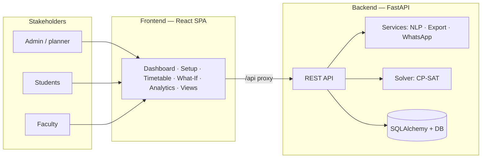
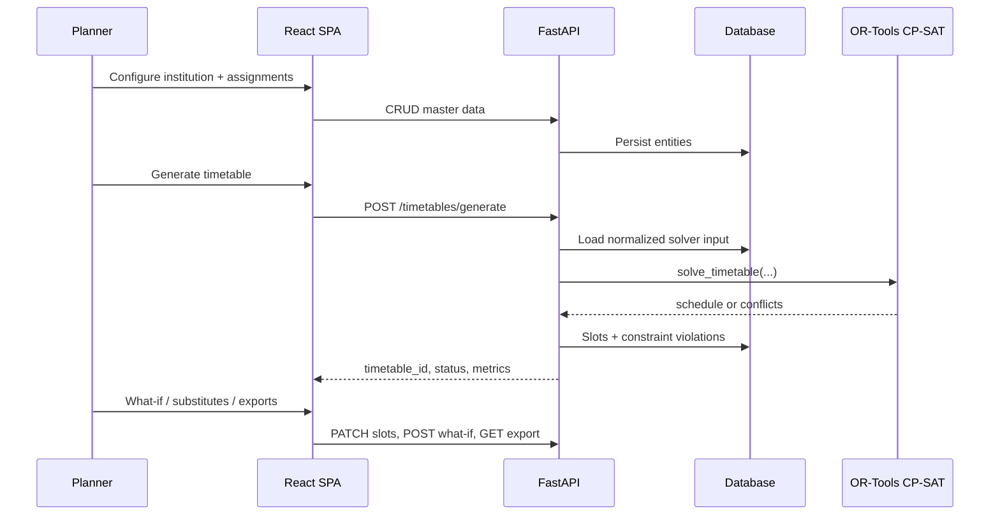
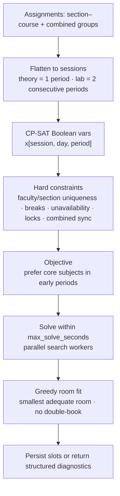
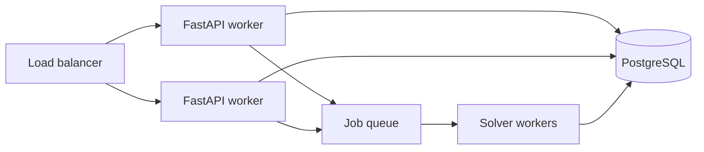

# ScheduleAI

<p align="center">
  <br>
  
  
  
</p>

<p align="center">
  <a href="https://fastapi.tiangolo.com/"></a>
  <a href="https://react.dev/"></a>
  <a href="https://developers.google.com/optimization"></a>
  <a href="https://www.python.org/"></a>
</p>

---

### The question

> **What if the hardest week on campus isn’t the first week of teaching — but the week before, when someone tries to squeeze every room, every professor, every lab block, and every combined lecture into a grid that still has to *breathe*?**

That’s the itch **ScheduleAI** scratches: not a lifeless spreadsheet you pray over, but a system that **models** your institution, **searches** for feasible timetables under real constraints, and **adapts** when Monday looks nothing like the plan.

---

### Why open this repo?


|      |                                                                                                                                                                                            |
| ---- | ------------------------------------------------------------------------------------------------------------------------------------------------------------------------------------------ |
| 🧩   | **“Is this mess even *solvable*?”** — Google **OR-Tools CP-SAT** either hands you a conflict-free grid or explains *why* the universe said no (overload, rooms, locks, labs…).             |
| 🔁   | **“What if this professor disappears for two days?”** — **What-if** runs clone your timetable, hunt for **substitutes**, and turn dead ends into honest **breaks** instead of silent lies. |
| 📊   | **“Are we *fair* to faculty and rooms?”** — **Analytics** turns the grid into load, utilization, gaps, and “core subjects in the morning” — so intuition gets a receipt.                   |
| 🎓📱 | **“Who actually needs to *see* this?”** — Dedicated **student** and **teacher** views, **Excel/PDF**, and optional **WhatsApp** hooks — publish, don’t just print.                         |
| 💬   | **“Can I just *say* the rule?”** — **NLP** parses plain English constraints (cloud or local fallback) — a teaser for how scheduling *could* feel in the future.                            |


---

<p align="center"><code>frontend/</code> · SPA · Vite · TypeScript · Tailwind &nbsp;·&nbsp; <code>backend/</code> · FastAPI · SQLAlchemy · solver in <code>solver/engine.py</code></p>

---

## Table of contents


| Section                                                 | What you’ll find                                       |
| ------------------------------------------------------- | ------------------------------------------------------ |
| **[What we built](#what-we-built)**                     | Product surface — what each part of the repo is        |
| **[Visual architecture](#visual-architecture)**         | Mermaid diagrams (system, sequence, solver, scale-out) |
| **[Differentiators](#differentiators)**                 | vs typical spreadsheet / lightweight tools             |
| **[Scalability](#scalability-analysis)**                | Strengths, limits, production path                     |
| **[Tech stack](#tech-stack)**                           | Libraries by layer                                     |
| **[Features](#features-at-a-glance)**                   | Capabilities in compact tables                         |
| **[Data model](#core-data-model)**                      | Main entities                                          |
| **[Scheduling & solver](#scheduling-logic-and-solver)** | Sessions, hard/soft rules, rooms                       |
| **[Frontend routes](#frontend-pages)**                  | Pages ↔ routes                                         |
| **[Backend API](#backend-api)**                         | HTTP surface (collapsible detail)                      |
| **[Environment](#environment-variables)**               | `.env` keys                                            |
| **[Seed & workflows](#seed-data)**                      | Demo data and checklists                               |
| **[Testing](#testing)**                                 | How to run tests                                       |
| **[Reference](#exports--nlp--limitations)**             | Exports, NLP, validation, limits, troubleshooting      |


---

## What we built

*For judges / reviewers — what each layer of the repo actually does.*


| Piece | What it is |
|:---|:---|
| **`frontend/`** | React + Vite + TypeScript + Tailwind SPA. **Pages:** Dashboard (generate + history), **Setup** (master data + NLP), **Timetable** (grid, lock, substitute, exports), **What-If**, **Analytics**, **Student** / **Teacher** views. API: `src/api/client.ts`. |
| **`backend/main.py`** | FastAPI: CRUD for institution graph; **POST `/timetables/generate`**; what-if; lock/substitute; analytics; Excel/PDF; NLP; optional WhatsApp. |
| **`backend/solver/engine.py`** | **OR-Tools CP-SAT**: sessions (theory + 2-period labs + combined sections), hard constraints, soft objective (core in morning), greedy rooms. |
| **`models.py` · `schemas.py`** | SQLAlchemy entities + Pydantic I/O. |
| **`backend/services/`** | `export_service`, `nlp_service`, `whatsapp_service`, `timetable_service`. |
| **`backend/seed.py`** | Demo dataset so you can generate immediately. |
| **Tests** | `backend/tests/test_backend.py` — generation, overlaps, locks, what-if, analytics, exports. |

**Run:** `cd backend && pip install -r requirements.txt && uvicorn main:app --reload --port 8000` · `cd frontend && npm i && npm run dev` — UI `http://localhost:5173`, API docs `http://localhost:8000/docs`. Optional: `python seed.py` in `backend/`.

---

## Visual architecture

Mermaid renders in **GitHub**, **Markdown Preview Enhanced**, and most modern Markdown viewers.

### System context




### Request flow (generation)




### Solver pipeline




---

## Differentiators


| Dimension        | Typical baseline           | ScheduleAI                                                              |
| ---------------- | -------------------------- | ----------------------------------------------------------------------- |
| **Engine**       | Heuristics or manual grids | **CP-SAT** with explicit hard constraints + objective                   |
| **Failures**     | “Cannot schedule”          | **Typed diagnostics** (overload, rooms, locks, …)                       |
| **After solve**  | Static file                | **Lock**, **substitutes**, **what-if** absence → clone timetable        |
| **Stakeholders** | One admin view             | **Student** & **Teacher** read-only views (latest **done** timetable)   |
| **Insight**      | Rare                       | **Analytics**: load, wellbeing proxy, utilization, gaps, core placement |
| **Constraints**  | Forms only                 | **NLP** parse (Anthropic + **local fallback**)                          |
| **Outreach**     | Email                      | **Excel/PDF** + optional **Twilio WhatsApp** APIs                       |


**In one line:** model → **solve** → **operate** → **measure** → **communicate**.

---

## Scalability analysis

### Strengths

- **Solver:** CP-SAT scales better than naive search; `max_solve_seconds` caps worst-case latency per request.
- **API:** Stateless handlers → horizontal scaling once DB + jobs are production-ready.
- **Domain:** Institution-scoped data → natural multi-tenant boundary.

### Current ceilings


| Layer            | As shipped                  | Typical next step                                                   |
| ---------------- | --------------------------- | ------------------------------------------------------------------- |
| **DB**           | SQLite default              | **PostgreSQL** + pooling (`DATABASE_URL`)                           |
| **Generation**   | Solver **in-request**       | **Job queue** + worker; timetable status `pending → running → done` |
| **Code**         | Large `main.py`             | Routers + service modules                                           |
| **Search space** | Grows with sessions × slots | Split by school/dept or staged solves                               |
| **Security**     | No auth                     | Identity + RBAC + tenant isolation                                  |


### Scale-out sketch




---

## Tech stack


| Layer         | Technologies                                                                                     |
| ------------- | ------------------------------------------------------------------------------------------------ |
| **UI**        | React 18, TypeScript, Vite, Tailwind CSS, React Router, Axios, Recharts, React Hot Toast, Lucide |
| **API**       | FastAPI, Pydantic v2, SQLAlchemy, Uvicorn                                                        |
| **Solver**    | Google OR-Tools **CP-SAT**                                                                       |
| **Exports**   | OpenPyXL (Excel), ReportLab (PDF)                                                                |
| **NLP**       | Anthropic SDK (optional) + local parser                                                          |
| **Messaging** | Twilio (optional WhatsApp)                                                                       |


---

## Project structure

```text
scheduleai/
├── backend/
│   ├── main.py              # FastAPI app + routes
│   ├── models.py            # SQLAlchemy entities
│   ├── schemas.py           # Pydantic I/O
│   ├── database.py          # Session / init
│   ├── config.py            # Settings (.env)
│   ├── seed.py              # Demo data
│   ├── solver/engine.py     # OR-Tools CP-SAT
│   └── services/
│       ├── export_service.py
│       ├── nlp_service.py
│       ├── timetable_service.py
│       └── whatsapp_service.py
├── frontend/
│   ├── src/
│   │   ├── App.tsx          # Shell + router
│   │   ├── api/client.ts    # Axios + API helpers
│   │   └── pages/           # Dashboard, Setup, Timetable, …
│   └── vite.config.ts       # /api proxy
└── README.md
```

---

## Features at a glance

### Institutional setup


| Area            | Capabilities                                                                |
| --------------- | --------------------------------------------------------------------------- |
| **Institution** | Working days, `periods_per_day`, `break_slots`, period length, `start_time` |
| **Rooms**       | Capacity; type: `classroom`, `lab`, or `lecture_hall` |
| **Faculty**     | Subjects, unavailable (day, period), `max_consecutive_periods`, contact     |
| **Courses**     | Theory/practical hours, credits, core flag, lab requirement                 |
| **Sections**    | Name, headcount, semester; optional class rep phone (WhatsApp broadcast)    |
| **Assignments** | Section–course–faculty; **combined groups** for shared lectures             |


### Timetable lifecycle


| Phase        | What the app does                                                                                             |
| ------------ | ------------------------------------------------------------------------------------------------------------- |
| **Generate** | `POST /timetables/generate` — CP-SAT + persist slots/violations; optional `locked_slots`, `max_solve_seconds` |
| **Inspect**  | Grid, per-section filter, slot panel, conflicts                                                               |
| **Operate**  | Toggle **lock**; list **substitutes**; **PATCH** substitute faculty                                           |
| **What-if**  | Clone timetable; absent faculty on chosen days → substitute or **break** slot                                 |
| **Analyze**  | Faculty load, wellbeing-style score, room %, section gaps, core-in-morning                                    |
| **Publish**  | Excel/PDF export; **Student** / **Teacher** views (latest **done** timetable)                                 |
| **NLP**      | `POST /nlp/parse-constraint` — structured constraint JSON (not auto-applied to solver yet)                    |


---

## Core data model


| Entity                  | Role                                                                                      |
| ----------------------- | ----------------------------------------------------------------------------------------- |
| **Institution**         | Calendar template for the whole deployment                                                |
| **Department**          | Scoped under institution; owns courses & sections                                         |
| **Room**                | Capacity + type; used in greedy assignment after CP-SAT                                   |
| **Faculty**             | Teaching subjects + unavailability JSON                                                   |
| **Course**              | Weekly theory/practical demand; core/lab flags                                            |
| **Section**             | Cohort in a department/semester                                                           |
| **SectionCourse**       | Maps section ↔ course ↔ faculty                                                           |
| **CombinedGroup**       | Multiple sections, one course/faculty (shared sessions)                                   |
| **Timetable**           | Version of a solve: status, solve time, metadata                                          |
| **Slot**                | One placed session: day, period, duration, room, flags (`locked`, `combined`, `modified`) |
| **ConstraintViolation** | Human-readable failure/diagnostic rows                                                    |


---

## Scheduling logic and solver

Implementation: `backend/solver/engine.py`.

### Sessions (input to CP-SAT)


| Rule     | Meaning                                                                         |
| -------- | ------------------------------------------------------------------------------- |
| Theory   | Each **theory hour** → one **1-period** session                                 |
| Lab      | Each **2** practical hours → one **2-period** lab block (consecutive non-break) |
| Combined | One session row shared across all sections in the group                         |


### Hard constraints (summary)


| #   | Constraint                                                                                    |
| --- | --------------------------------------------------------------------------------------------- |
| 1   | Each session scheduled **exactly once**                                                       |
| 2   | No **faculty** double-booking (overlap-aware for labs)                                        |
| 3   | No **section** double-booking                                                                 |
| 4   | **Break** periods never used                                                                  |
| 5   | **Faculty unavailable** slots forbidden                                                       |
| 6   | **Labs** only start where next period is valid and non-break                                  |
| 7   | **Locked** slots pinned to (day, period, occurrence)                                          |
| 8   | **Combined** sections share identical placement                                               |
| 9   | **Room** fit: capacity + type (lab vs non-lab), assigned **after** solve (greedy, no overlap) |


### Soft objective

- Prefer **core** courses in **early** periods (morning bias).

### When solve fails

Diagnostics may include: section overload, faculty overload, no valid slot, room/lab shortage, locked-slot conflicts — see API response `conflicts` / stored violations.

---

## Frontend pages


| Path         | Page             | Purpose                                                    |
| ------------ | ---------------- | ---------------------------------------------------------- |
| `/`          | **Dashboard**    | Pick institution, generate, history, high-level stats      |
| `/setup`     | **Setup**        | CRUD for all master data + NLP constraint UI               |
| `/timetable` | **Timetable**    | Interactive grid, lock/substitute, exports                 |
| `/what-if`   | **What-If**      | Absence simulation on a chosen timetable                   |
| `/analytics` | **Analytics**    | Charts: load, utilization, core distribution, …            |
| `/student`   | **Student view** | Latest done timetable for a section                        |
| `/teacher`   | **Teacher view** | Latest done timetable for a faculty member in a department |


---

## Backend API

Base URL (local): `http://localhost:8000` — frontend uses `/api/...` via Vite proxy.

Interactive docs: `**GET /docs`**, `**GET /redoc**`.

**Health & CRUD (institution-scoped)**


| Method                 | Path                                           |
| ---------------------- | ---------------------------------------------- |
| GET                    | `/health`                                      |
| POST, GET, GET/PUT     | `/institutions`, `/institutions/{id}`          |
| POST, GET, PUT, DELETE | `/departments` (query `institution_id` on GET) |
| POST, GET, PUT, DELETE | `/rooms` (`institution_id`)                    |
| POST, GET, PUT, DELETE | `/faculty` (`institution_id`)                  |
| POST, GET, PUT, DELETE | `/courses` (`department_id`)                   |
| POST, GET, PUT, DELETE | `/sections` (`department_id`)                  |
| POST, GET, DELETE      | `/section-courses` (`section_id` on GET)       |
| POST, GET, DELETE      | `/combined-groups` (`institution_id` on GET)   |


**Timetables, views, operations**


| Method           | Path                                                              |
| ---------------- | ----------------------------------------------------------------- |
| POST             | `/timetables/generate`                                            |
| GET, GET, DELETE | `/timetables`, `/timetables/{tt_id}`                              |
| GET              | `/views/student?institution_id&department_id&semester&section_id` |
| GET              | `/views/teacher/faculty?institution_id&department_id`             |
| GET              | `/views/teacher?institution_id&department_id&faculty_id`          |
| POST             | `/timetables/what-if`                                             |
| PATCH            | `/slots/{slot_id}/lock`, `/slots/{slot_id}/substitute`            |
| GET              | `/timetables/{tt_id}/substitutes?slot_id=...`                     |
| GET              | `/timetables/{tt_id}/analytics`                                   |


**Generate body (example):**

```json
{
  "institution_id": 1,
  "name": "Semester Timetable",
  "semester": "5",
  "locked_slots": [],
  "max_solve_seconds": 60
}
```

Response highlights: `timetable_id`, `status`, `solve_time`, `num_slots`, `conflicts`, `objective`.


**NLP, export, notifications**


| Method | Path                                       |
| ------ | ------------------------------------------ |
| POST   | `/nlp/parse-constraint`                    |
| GET    | `/timetables/{tt_id}/export/excel`         |
| GET    | `/timetables/{tt_id}/export/pdf`           |
| POST   | `/notifications/whatsapp/send`             |
| POST   | `/notifications/whatsapp/send-to-sections` |


---

## Environment variables

Loaded via `pydantic-settings` from `backend/.env` (copy from `backend/.env.example`).


| Variable                                                          | Role                                           |
| ----------------------------------------------------------------- | ---------------------------------------------- |
| `DATABASE_URL`                                                    | Default SQLite; use Postgres URL in production |
| `ANTHROPIC_API_KEY`                                               | Optional; richer NLP when set                  |
| `TWILIO_ACCOUNT_SID`, `TWILIO_AUTH_TOKEN`, `TWILIO_WHATSAPP_FROM` | Required for WhatsApp routes                   |
| `SECRET_KEY`                                                      | App secret                                     |
| `CORS_ORIGINS`                                                    | Comma-separated browser origins                |


---

## Seed data

`backend/seed.py` builds a demo **Delhi Technical College** dataset (CS dept, multiple sections/faculty/rooms/courses, one combined group).

```bash
cd backend
# venv active
python seed.py
```

Fastest path: seed → Dashboard → generate → Timetable / Analytics / views.

### Before generation (checklist)

- ≥1 department, section, faculty, room  
- Every section covered by section–course or combined group  
- If any course has practical hours: ≥1 **lab** room  
- Faculty **subjects** must match assigned courses

**Manual setup workflow (no seed)**

1. Institution in **Setup**
2. Department → rooms → faculty → courses → sections
3. Section–course mappings and/or combined groups
4. **Dashboard** → generate


---

## Testing

```bash
cd backend
python -m unittest tests.test_backend
```

Covers generation on seeded data, overlaps, locked slots, what-if, analytics, exports, infeasible room scenarios.

---

## Exports, NLP, limitations

### Excel / PDF


| Format    | Behavior                                                                             |
| --------- | ------------------------------------------------------------------------------------ |
| **Excel** | One sheet per section; row=day, col=period; styled cells; course/faculty/room labels |
| **PDF**   | One page per section; printable grid                                                 |


### NLP

`POST /nlp/parse-constraint` returns structured fields (e.g. type, faculty/course names, day/period hints, confidence). It does **not** yet persist rules into the solver automatically — integration point for future work.

**Example natural-language inputs**

- `Dr. Sharma cannot teach before 10:30 on Mondays`  
- `Operating Systems should be scheduled in the morning`  
- `Machine Learning should avoid Friday`  
- `Prof. Mehta should not have more than 3 consecutive periods`


**Validation highlights (backend)**

- Unique institution name; unique department/room/section/course names within scope  
- Unique faculty email per institution (if provided)  
- Practical hours **even** (2-period lab blocks)  
- Unavailability must match institution calendar  
- Combined groups: ≥2 sections, same dept & semester, eligible faculty, no conflicting individual assignments  
- Many deletes blocked if entity appears in timetable slots  
- Institution calendar updates blocked if they invalidate faculty unavailability or existing slots


**Known limitations**

- No authentication or authorization  
- Monolithic `main.py` (hackathon-style)  
- SQLite default — not ideal for heavy concurrent production use  
- NLP parses only; does not auto-apply to CP-SAT  
- WhatsApp needs Twilio; does not auto-sync timetables to stakeholders  
- UI may not expose every API knob (e.g. all generate parameters)  
- Soft objective is intentionally narrow (core-in-morning focus)


**Troubleshooting**


| Symptom                    | Check                                                                     |
| -------------------------- | ------------------------------------------------------------------------- |
| Backend won’t start        | `cd backend`, venv active, `pip install -r requirements.txt`              |
| Frontend 404 on API        | Backend on `:8000`, frontend on `:5173`, Vite proxy `/api` → `8000`       |
| Generation fails           | Section coverage, faculty subjects, lab rooms, capacities, unavailability |
| Empty student/teacher view | Need a timetable with `status` **done** (latest wins)                     |
| Weak NLP                   | Set `ANTHROPIC_API_KEY`; else local regex parser                          |


---

## Summary

**ScheduleAI** is an end-to-end **timetable platform**: validated CRUD, **CP-SAT** solving with diagnostics, **interactive** post-processing, **what-if** planning, **analytics**, **exports**, stakeholder **views**, optional **NLP** and **WhatsApp** hooks. For a demo: `**python seed.py`**, generate from the **Dashboard**, then explore **Timetable**, **What-If**, **Analytics**, and the read-only **Student** / **Teacher** pages.